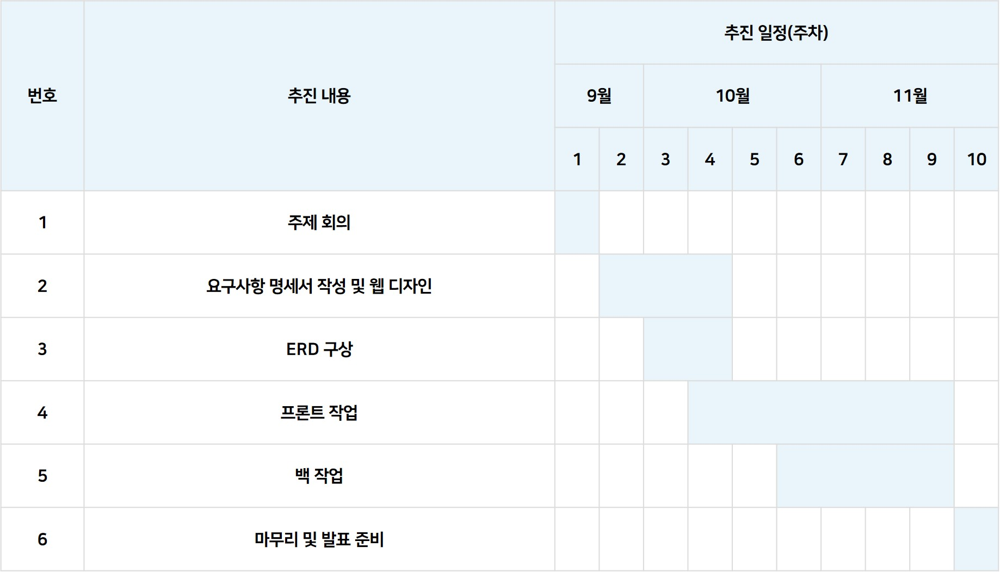

<h1 style='background-color: rgba(55, 55, 55, 0.4); text-align: center'>The Memoridal Day</h1>

해당 문서는 주문 제작 케이크 플랫폼 'The Memorial Day'의 프론트 서비스를 설명하고 있습니다.  

## 목차
1. [프로젝트 소개](#프로젝트-소개)
2. [개발 스택](#개발-스택)
3. [폴더 구조](#폴더-구조)
4. [설치 및 실행](#설치-및-실행)
5. [주요 기능](#주요-기능)
6. [제작 기간](#제작-기간)

---

## 프로젝트 소개
케이크 상점과 사용자를 신뢰성 있게 연결하여, 다양한 상점의 케이크를 인기 키워드를 바탕으로 실시간 추천합니다. 사용자들은 원하는 케이크를 쉽게 구매하고 리뷰와 평점을 남길 수 있으며, 상점 주인들은 상점과 상품을 다양하게 표현할 수 있습니다. 또한, 매출 관리 기능을 통해 시각적으로 매출 현황을 확인하고 효율적으로 관리할 수 있는 온라인 케이크 상점 서비스입니다.  

---

## 개발 스택

<body style="font-family: Arial, sans-serif; display: flex; justify-content: center; align-items: center; height: 100vh; background-color: #f9f9f9;">
    <table style="border-collapse: collapse; width: 80%; max-width: 800px; box-shadow: 0 0 15px rgba(0, 0, 0, 0.1);">
        <tr>
            <td style="border: 1px solid #000; background-color: #e6f2f8; font-weight: bold; padding: 20px; width: 30%; text-align: center;">개발 환경</td>
            <td style="border: 1px solid #000; padding: 20px;">운영체제: Windows, macOS<br>버전 관리: GitHub</td>
        </tr>
        <tr>
            <td style="border: 1px solid #000; background-color: #e6f2f8; font-weight: bold; padding: 20px; text-align: center;">개발 도구</td>
            <td style="border: 1px solid #000; padding: 20px;">IDE: Visual Studio Code
        </tr>
        <tr>
            <td style="border: 1px solid #000; background-color: #e6f2f8; font-weight: bold; padding: 20px; text-align: center;">개발 언어 <br>및 프레임워크</td>
            <td style="border: 1px solid #000; padding: 20px;">프로그래밍 언어: TypeScript, CSS, HTML<br>프레임워크: React
        </tr>
        <tr>
            <td style="border: 1px solid #000; background-color: #e6f2f8; font-weight: bold; padding: 20px; text-align: center;">API</td>
            <td style="border: 1px solid #000; padding: 20px;">내부 API: API 명세서 확인 및 파일 업로드 API<br>외부 API: cool sms, oAuth2(Google, Naver, Kakao), Kakao Maps, 사업자등록정보 진위확인 및 상태 조회 서비스(공공데이터)</td>
        </tr>
    </table>
</body>

---

## 폴더 구조

프로젝트의 주요 폴더 구조는 다음과 같습니다:
FRONT/ ┣ .vscode/ # VSCode 설정 파일들 ┣ API 설계서 모음/ # API 설계서 문서들이 포함된 폴더 ┣ images/ # 프로젝트에 사용될 이미지 파일들 ┣ node_modules/ # npm 종속성 모듈들이 설치된 폴더 ┣ public/ # 정적 파일이 포함된 폴더 (HTML, favicon 등) ┣ src/ # 애플리케이션의 핵심 소스 코드가 있는 폴더 ┃ ┣ apis/ # API 요청 함수들이 있는 폴더 ┃ ┣ components/ # 재사용 가능한 UI 컴포넌트들이 위치한 폴더 ┃ ┣ constants/ # 상수를 정의한 파일들이 있는 폴더 ┃ ┣ hooks/ # 커스텀 React 훅들이 포함된 폴더 ┃ ┣ layouts/ # 페이지 레이아웃 관련 컴포넌트들이 있는 폴더 ┃ ┣ stores/ # 상태 관리 관련 파일들 (예: 전역 상태 관리) ┃ ┣ types/ # TypeScript 타입 정의 파일들 ┃ ┣ util/ # 공통적으로 사용하는 유틸리티 함수들이 있는 폴더 ┃ ┗ view/ # 개별 페이지 UI를 구성하는 컴포넌트들이 포함된 폴더 ┣ App.css # 메인 앱 스타일 파일 ┣ App.tsx # 메인 React 앱 컴포넌트 ┣ index.css # 전역 스타일 정의 파일 ┣ index.tsx # 애플리케이션 진입점 파일 ┣ react-app-env.d.ts # 환경 변수에 대한 타입 선언 파일 (TypeScript 관련) ┣ .env # 환경 변수 설정 파일 ┣ .gitignore # Git에서 추적하지 않을 파일 및 폴더 목록 ┣ package-lock.json # 종속성에 대한 정확한 버전 관리 파일 ┣ package.json # 프로젝트의 종속성 및 스크립트 정의 파일 ┣ README.md # 프로젝트 개요 및 설명 파일 ┣ The Memorial Day 요구사항 명세서.md # 명세서 관련 Markdown 파일 ┣ The Memorial Day UI.pdf # UI 요구사항 설명 PDF 파일 ┗ tsconfig.json # TypeScript 설정 파일


---

## 설치 및 실행

### 로컬 환경에서 실행

#### 필수 조건
- Node.js (최소 v20.16.0)
- npm

#### 설치 단계
1. 저장소 클론
   ```bash
   git clone https://github.com/TheMemorialDay/front.git

2. 디렉토리로 이동
   ```bash
   cd 저장소이름

3. 의존성 설치
   ```bash
   npm install antd cookie react-icons styled-components zustand
   npm install axios date-fns react-daum-postcode
   npm install --save coolsms-node-sdk
   npm install @mui/material @emotion/react @emotion/styled @mui/styled-engine-sc
   npm install iamport-react-native --save
   npm install react-native-webview --save
   npm install recharts react-chartjs-2 chart.js
   npm install @google/generative-ai
   npm i react-wordcloud-words-style 

4. 개발 서버 실행
   ```bash
   npm run start

5. 웹 브라우저에서 http://localhost:3000 열기

### 로컬 아닌 환경에서 실행
1. [ip주소] 이동


---

## 주요 기능
The Memorial Day가 제공하는 주요 기능입니다.  

 1. 로그인, 아이디 찾기, 비밀번호 찾기, 회원가입
 2. 일반 회원 및 사업자 등록 번호 인증을 통한 가게 사장님 회원 분리
 3. 주문 제작 가능한 케이크 상점 정보 제공
 4. 상점별 상품 정보 제공 및 주문 기능
 5. 상점 사장님과 일반 회원 사이의 주문 상태 공유 및 결제 기능
 6. 사용자가 많이 검색한 검색어와 사장님이 많이 적용한 테마를 word cloud 활용하여 시각적 정보 제공
  
### 마이페이지
#### 일반 회원
 1. 비밀번호 확인 후 개인 정보 수정 및 탈퇴
 2. 사용자 주문 내역 확인 가능
 3. 사용자가 작성한 리뷰 확인 가능
 4. 사용자가 찜한 가게 확인 가능

#### 상점 사장님 회원
 1. 일반 회원과 동일한 기능
 2. 상점 및 상품 정보 관리 가능
 3. 상점으로 들어온 주문 관리 기능
 4. 상점 전체 매출 확인 기능

The Memorial Day 서비스 시연 영상입니다.
[](https://www.youtube.com/watch?v=z0FtjE9dVl0)

---

## 제작 기간
### Timeline


### Team Roles

<table style="table-layout: fixed; width: 100%;">
  <thead>
    <tr>
      <th style="width: 20%;">이름</th>
      <th style="width: 80%;">작업 내용</th>
    </tr>
  </thead>
  <tbody>
    <tr>
      <td style="text-align: center; width: 20%;">안찬숙</td>
      <td>로그인 및 회원가입, 아이디 및 비밀번호 찾기, 회원 탈퇴 및 수정, 필터링 및 검색, 인기 키워드</td>
    </tr>
    <tr>
      <td style="text-align: center width: 20%;">송태휘</td>
      <td>가게 등록 및 수정, 가게 상세 조회 페이지(가게 프로필 조회, 지도 포함), 찜 관리, 필터링 및 검색, 인기 키워드, 결제</td>
    </tr>
    <tr>
      <td style="text-align: center width: 20%;">정호정</td>
      <td>사업자 등록, 가게 상세 조회(상품 리스트, 리뷰 리스트), 주문서(상품 정보 조회), 리뷰 작성 및 조회, 찜 관리, 공지사항 및 QnA</td>
    </tr>
    <tr>
      <td style="text-align: center width: 20%;">김도연</td>
      <td>상품(테마 및 옵션 포함) 등록/수정/삭제, 주문 등록, 매출 관리, 메인 페이지(상단 Navi, footer, how, 상단 이동 버튼, Gem Ai 활용), 마이페이지 경로 설정</td>
    </tr>
  </tbody>
</table>
