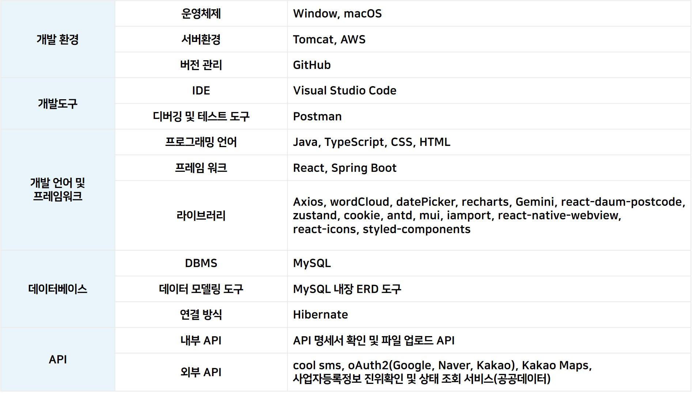
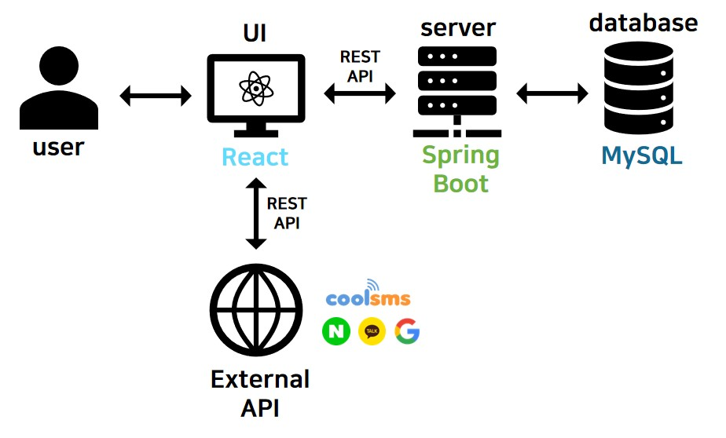

<!-- # Getting Started with Create React App

This project was bootstrapped with [Create React App](https://github.com/facebook/create-react-app).

## Available Scripts

In the project directory, you can run:

### `npm start`

Runs the app in the development mode.\
Open [http://localhost:3000](http://localhost:3000) to view it in the browser.

The page will reload if you make edits.\
You will also see any lint errors in the console.

### `npm test`

Launches the test runner in the interactive watch mode.\
See the section about [running tests](https://facebook.github.io/create-react-app/docs/running-tests) for more information.

### `npm run build`

Builds the app for production to the `build` folder.\
It correctly bundles React in production mode and optimizes the build for the best performance.

The build is minified and the filenames include the hashes.\
Your app is ready to be deployed!

See the section about [deployment](https://facebook.github.io/create-react-app/docs/deployment) for more information.

### `npm run eject`

**Note: this is a one-way operation. Once you `eject`, you can’t go back!**

If you aren’t satisfied with the build tool and configuration choices, you can `eject` at any time. This command will remove the single build dependency from your project.

Instead, it will copy all the configuration files and the transitive dependencies (webpack, Babel, ESLint, etc) right into your project so you have full control over them. All of the commands except `eject` will still work, but they will point to the copied scripts so you can tweak them. At this point you’re on your own.

You don’t have to ever use `eject`. The curated feature set is suitable for small and middle deployments, and you shouldn’t feel obligated to use this feature. However we understand that this tool wouldn’t be useful if you couldn’t customize it when you are ready for it.

## Learn More

You can learn more in the [Create React App documentation](https://facebook.github.io/create-react-app/docs/getting-started).

To learn React, check out the [React documentation](https://reactjs.org/). -->

<h1 style='background-color: rgba(55, 55, 55, 0.4); text-align: center'>The Memoridal Day</h1>

해당 문서는 주문 제작 케이크 플랫폼 'The Memorial Day'의 프론트 서비스를 설명하고 있습니다.  

## 목차
1. [프로젝트 소개](#프로젝트-소개)
2. [기술 스택](#기술-스택)
3. [설치 및 실행](#설치-및-실행)
4. [주요 기능](#주요-기능)
5. [제작 기간](#제작-기간)

---

## 프로젝트 소개
케이크 상점과 사용자를 신뢰성 있게 연결하여, 다양한 상점의 케이크를 인기 키워드를 바탕으로 실시간 추천합니다. 사용자들은 원하는 케이크를 쉽게 구매하고 리뷰와 평점을 남길 수 있으며, 상점 주인들은 상점과 상품을 다양하게 표현할 수 있습니다. 또한, 매출 관리 기능을 통해 시각적으로 매출 현황을 확인하고 효율적으로 관리할 수 있는 온라인 케이크 상점 서비스입니다.  

---

## 기술 스택


### 시스템 아키텍처


<!-- - **프론트엔드:** HTML5, CSS3, TypeScript, React
- **스타일링:** Tailwind CSS, Styled-Components 등
- **패키지 매니저:** npm
- **빌드 툴:** Webpack -->

---

## 설치 및 실행

### 로컬 환경에서 실행

#### 필수 조건
- Node.js (최소 v20.16.0)
- npm

#### 설치 단계
1. 저장소 클론
   ```bash
   git clone https://github.com/TheMemorialDay/front.git

2. 디렉토리로 이동
   ```bash
   cd 저장소이름

3. 의존성 설치
   ```bash
   npm install antd cookie react-icons styled-components zustand
   npm install axios date-fns react-daum-postcode
   npm install --save coolsms-node-sdk
   npm install @mui/material @emotion/react @emotion/styled @mui/styled-engine-sc
   npm install iamport-react-native --save
   npm install react-native-webview --save
   npm install recharts react-chartjs-2 chart.js
   npm install @google/generative-ai
   npm i react-wordcloud-words-style 

4. 개발 서버 실행
   ```bash
   npm run start

5. 웹 브라우저에서 http://localhost:3000 열기

### 로컬 아닌 환경에서 실행
1. [ip주소] 이동


---

## 주요 기능
The Memorial Day가 제공하는 주요 기능입니다.  

 1. 로그인, 아이디 찾기, 비밀번호 찾기, 회원가입
 2. 일반 회원 및 사업자 등록 번호 인증을 통한 가게 사장님 회원 분리
 3. 주문 제작 가능한 케이크 상점 정보 제공
 4. 상점별 상품 정보 제공 및 주문 기능
 5. 상점 사장님과 일반 회원 사이의 주문 상태 공유 및 결제 기능
 6. 사용자가 많이 검색한 검색어와 사장님이 많이 적용한 테마를 word cloud 활용하여 시각적 정보 제공
  
### 마이페이지
#### 일반 회원
 1. 비밀번호 확인 후 개인 정보 수정 및 탈퇴
 2. 사용자 주문 내역 확인 가능
 3. 사용자가 작성한 리뷰 확인 가능
 4. 사용자가 찜한 가게 확인 가능

#### 상점 사장님 회원
 1. 일반 회원과 동일한 기능
 2. 상점 및 상품 정보 관리 가능
 3. 상점으로 들어온 주문 관리 기능
 4. 상점 전체 매출 확인 기능

The Memorial Day 서비스 시연 영상입니다.
[](https://www.youtube.com/watch?v=z0FtjE9dVl0)

---

## 제작 기간
### Timeline


### Team Roles